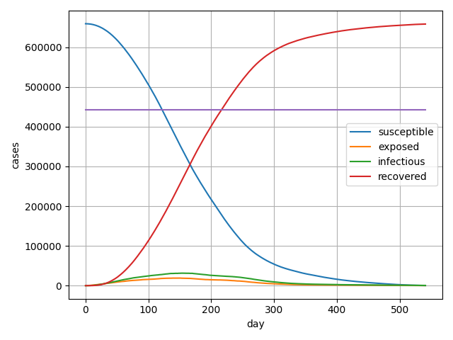
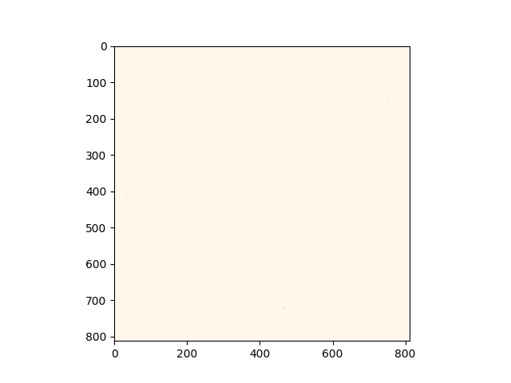
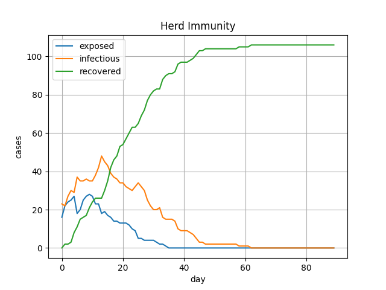
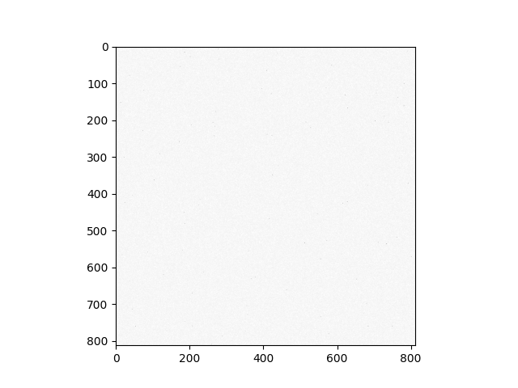
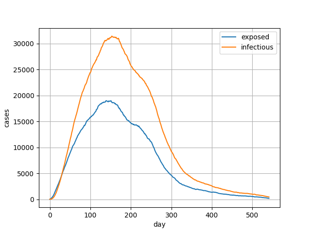

# COVID-19-CA-SEIR
Simulation for spreading of COVID-19 using CA-SEIR model

利用元胞自动机研究新冠病毒的传播，使用的传播模型为`SEIR`。

---

本项目为一门选修课的实验作业，通过模拟新冠病毒传播来研究英国“群体免疫”策略的可行性，使用的传染病模型为`CA-SEIR`，全称为"Cellular Automata-SEIR"，参考论文为[*Cellular Automata Model for Epidemics*](http://csc.ucdavis.edu/~chaos/courses/nlp/Projects2008/SharonChang/Report.pdf)，主要思想为利用元胞自动机模拟病毒传染。

## 如何使用

安装依赖：

```bash
pip install -r requirements.txt
```

进入`main.py`，根据需要修改参数：

```python
N = 660000 # 总人口
N_infected = 26  # 初始感染人口
N_recovered = 517440  # 群体免疫阈值
beta = 0.3 # 传染率
gamma = 1 / 10 # 恢复率
sigma = 1 / 5 # 暴露人员变为感染的概率
```

各参数具体含义详见“**相关参数以及假设**”部分

开始模拟：

```bash
python main.py
```

将输出的图片合成gif：

```bash
python gif.py
```

效果如下：





> 下面是实验报告

## 相关参数以及假设

根据[国家卫健委网站](http://www.nhc.gov.cn/)上的相应数据以及国内外论文里给出的新冠病毒各项参数，找到了下列需要用到的参数：

+ 平均潜伏期为6天
+ 平均住院时间 10天
+ 潜伏期也会传染
+ <a href="https://www.codecogs.com/eqnedit.php?latex=R_0" target="_blank"></a>在2~3.5范围内
+ 传染率<a href="https://www.codecogs.com/eqnedit.php?latex=\beta=\gamma&space;R_0=0.3" target="_blank"></a>
+ 恢复率<a href="https://www.codecogs.com/eqnedit.php?latex=\gamma" target="_blank"></a> ，由平均住院时间 10天，得恢复率为<a href="https://www.codecogs.com/eqnedit.php?latex=\frac{1}{10}" target="_blank"></a>
+ 暴露人员变为感染的概率<a href="https://www.codecogs.com/eqnedit.php?latex=\sigma" target="_blank"></a>，<a href="https://www.codecogs.com/eqnedit.php?latex=\frac{1}{6}" target="_blank"></a>
+ 英国总人口为6600万，截止2月18日全国感染人数为2626

“群体免疫”通常是指，人群中易感个体的感染风险因免疫个体的存在而降低。

具体的公式为：<a href="https://www.codecogs.com/eqnedit.php?latex=V_c=\frac{1-\frac{1}{R_0}}{E}" target="_blank"></a>，其中E是抗体有效力  ，其含义是有抗体者与对照个体之间的感染传播减少率；而<a href="https://www.codecogs.com/eqnedit.php?latex=V_c" target="_blank"></a>即为临界免疫水平。<a href="https://www.codecogs.com/eqnedit.php?latex=R_0" target="_blank"></a>保守估计为3,而根据[广东省疾控中心的说法](https://3g.163.com/news/article_cambrian/F6I5TTVG053299CD.html)，出院患者复阳率为14%，因此保守估计E=85%。由此可得<a href="https://www.codecogs.com/eqnedit.php?latex=V_c=\frac{1-\frac{1}{3}}{0.85}=78.4\%" target="_blank"></a>，即英国人口的78.4%被感染后，疫情才能被有效抑制。接下来对78.4%的人口具有免疫力时的情况进行模拟

同时，对模型做出如下假设：

+ 假设居民自觉性良好，不进行旅游，少与其他人来往，每天的亲密接触者为4人（即元胞自动机中cell的上下左右4个cell）
+ 假设2月18日时确诊的26个cell在全国随机分布
+ 假设患者康复后不再具有传染性，也不能被传染

## 群体免疫

模拟的数据量相比真实数据缩小100倍，即660,000人，截止2月18日有26人确诊。

由于本模型假设康复后不再具有传染性也不再被传染，所以E仍然取1,算得<a href="https://www.codecogs.com/eqnedit.php?latex=V_c=67\%" target="_blank"></a>，此时`recovered`人群有442200(00)人。由于随机性，实际上元胞自动机初始时的`recovered`人群为441793(00),由此开始模拟，初始化元胞自动机后，让其运行90天（3个月），得到下图：



下面的动图展示的是元胞自动机模拟传染的情况 ，灰色表示患病康复的人，白色表示易感者，偶尔出现的黑色小点表示被传染的人（要仔细看才能看到）：



由上面两张图可得，群体免疫在理论上的确能取得很好的阻断传播效果。疫情在40天后基本结束，并且被感染人数的峰值仅在5,000人左右，而3个月中一共被感染的人数为10,000人出头。

## 实际情况模拟

截止2月18日，英国累计确诊2626人确诊，在元胞自动机中相当于26个cell在`infectious`状态，假定处在`recovered`和`exposed`状态的cell数为0。

由此开始模拟得到如下图：


为了更清楚地看到`infectious`和`exposed`两者的变化，下图只画了这两种状态：



下面的动图展示的是元胞自动机模拟传染（每50天记录一次）的情况：


根据两次模拟结果可得：

+ 康复人数在达到**临界免疫水平**(44,220,000)后仍然急速上升
+ 确诊人数的峰值在大约150天后（**8月份**）达到最高点。
+ 在英国的现行政策下，新冠肺炎会在流行1年半后（2021年9月）才逐渐消失

## 模型存在的不足

+ 本`CA-SEIR`比较简易，由于是矩阵结构，因此密切接触者只能是4人，若使用更复杂的元胞自动机，应该会模拟出更好的效果
+ 没有考虑传染参数的动态性，例如$R_0$是随着人员流动性而变化的
+ 没有考虑英国各地区人口密度的不同